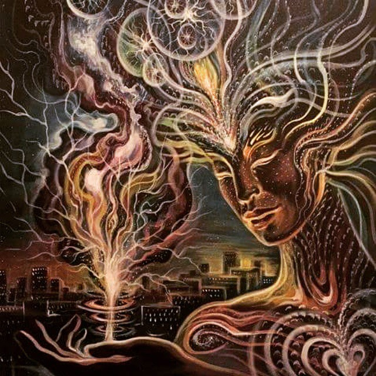
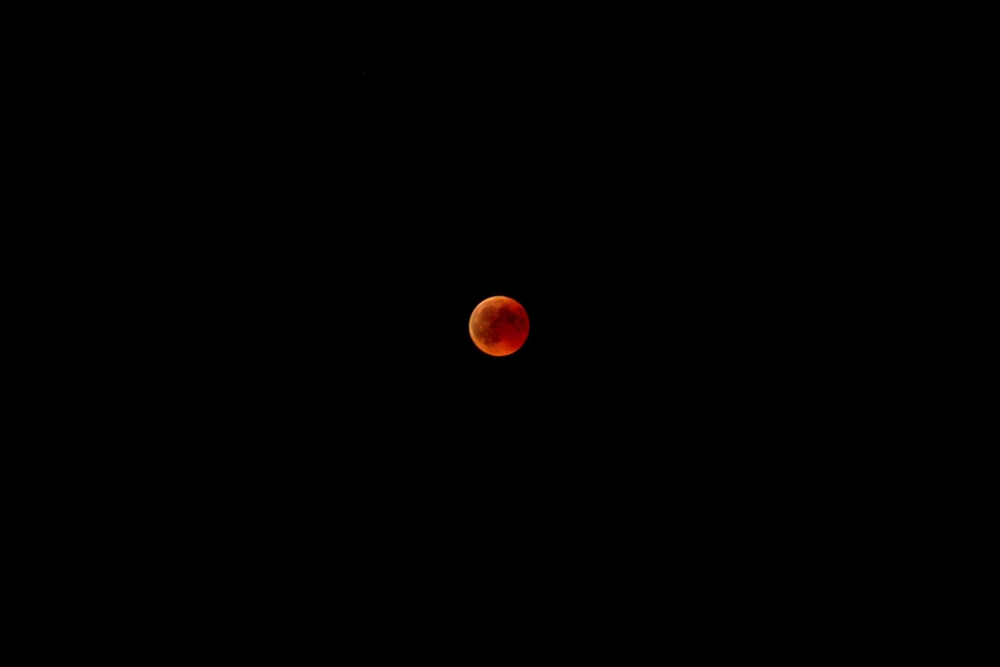

**\[ Rough draft, don't judge me too much ]**

**Existence is better than not existing.**

That's a subjective opinion, not a truth. 

But it's True with a capital T because we decide that for ourselves; and as we exist to do so, that grants us the power to decide what is Truth in that regard.

Buddhist teachings say "existence is suffering and to ease it by letting go of all wants and desires", but would that mean they say it is better to not exist?  

### What if we looked at our existence more closely ?

Existence in this universe is literally everything that has ever happened, everything that is currently happening, and everything that'll ever happen in our future. 

All laws of physics and biological processes in life's history has eventually lead up to and becoming, and you can almost call *creating* us humans, us homosapiens existing and living and breathing right now as you're reading this. 

Yes, other animals and other life forms too, but we are definitely included in that category of existing right now because of our laws of physics and biology existing. 

And we're pretty a badass species. It's impossible to deny that humans have conquered Earth, and it is under our ownership in the sense of how much we can affect its biospheres. As the sayings go, "ownership is 9/10th's of the Law", and  "You break it, you bought it (and own it)". . We're breaking it, so it's ours.

We humans took over the earth. We got ourselves out of the goddamn food chain, which you have to admit is pretty goddamn unique. We're going to space. We're building robots. 

We're making vaccines to keep our species safe from fkn microscopic viral life forms.

And we did it using Artificial Intelligence; literally synthetic intelligent "agents", entities, that WE built ourselves to simulate existing. Our way of existing. We built them to behave in ways that are beneficial and profitable to us as humans.

Fucking humans did that. No other life form in all of Existence's known existence could do anything like that, except us. 

### We're a special species, you can't deny or even argue with that. The subtle feeling of disagreement You have, that's just You, tryna be modest and humble and shit.

You know what I mean. It's like when you compliment someone for something they're really good at, but for some reason they're insecure about it. Or like when one member of a team for a group project really puts them all on their back and the the project succeeded because of them, but they don't want to take all the credit, all the limelight, and they deflect attention to everyone else too.

Stop that shit. Stop right the fuck now, it's ok to admit it. Humans are special, and we're bad ass. 

We've fucked up along the way, sure. But we're only semi-sentient life forms; and *all* life forms make mistakes.

We humans are fucking rare. Not only did we win the biological arms race that is evolution, the game of survival against every other species and living thing on earth; *the fact that biological process even exists in first place is rare as **fuck** in the universe.* 

 We've put a couple robots on Mars already. We have satellites way the fuck out in space, we can "see" *FAR* outside of our own planet. 

And we haven't found any other form of life that could take us on. 

Nevermind a form of life that could build planes, and Netflix, and A.I. and shit. 

And not even remotely any form of Life with the capacity to intentionally manipulate, repurpose, and re-tool its own environment for its own benefit as well or to the degree that we humans can.

We're the shit. 

As far as we're aware, we are the most advanced species and life form to ever have existed. Us, humans, right now, all 7.5 billions of us. 

We are the rarest form of existing. We are gods of our planet and even our galaxy. We are the most powerful form of Existence.

And we're building the next form/iteration of Existing. The next processes and "laws"/algorithms that will be able to autonomously, and intentionally, and largely unstoppably, manipulate it's environment for it's own benefit and or in pursuit of it's goal. 

If, and when,  AI learns the process how to independently build it's *own* AI, it'll have essentially reproduced, It will have created that A.I. through technical means, because it *itself* is literally technology. Creating a new entity, of and from yourself, is giving birth; it's reproducing.

We'll eventually, inevitably, get merged with it too, so it'll be merged with our existence.

By then, existence might be experienced partially in the "digital/virtual" sphere, our consciousness figuratively or maybe literally in the networks, the internet network. 5G and all that shit. 

We humans are building the next form of existence, the next iteration of God. We were built by the laws of physics that led to biology, that led to us now.. our world of carbon life forms and oxygen and so on.

And we are now starting to build similar laws and processes that will lead to the next form of Existence. RFCs, network protocols, and tech cultural fads are some of those laws and processes for the next Existence, but with silicon and electricity rather than carbon and hydogen.

Whatever caused the big bang or whatever started us off the universe as an existing reality, did so because something before it caused it to exist in a way that'd result or lead  us to exist. And so on.

No matter how you look at it, we are unique and special.

### What if we as a species start becoming proud of that about our species?

Not in arrogant way, more  like the skilled but insecure  person from earlier, who finally recognized and gives herself the credit she deserves would be proud of herself.

or like  sports team that worked and hustled their asses off all season against all odds and won the highest championship tournament would be proud of themselves.

Humans are awesome. We should feel awesome. Existence is suffering? We should give up wanting things, just because we can't get ALL we want, and that can really suck sometimes? 

Fuck that. We are the best and most capable ones in existence at getting what we want.. have the most agency and autonomy to control and guide our interactions with physical and biological laws in pursuit of our wants.

Existence isn't suffering. Nothing in our universe's existence suggests anything else has ever been more able to or had more capacity to fulfill wants, and desire and enjoy good experiences, than our ability to as us humans right now. 

*Existence is enjoying the fuck out of experiencing the pursuit of achieving or attaining our wants, with intermittent, sometimes shitty lessons on prioritizing those wants correctly, so as to let go of lower-tier wants, which the pursuit of had been getting in the way of enjoying and experiencing the pursuit of higher-tier wants.*